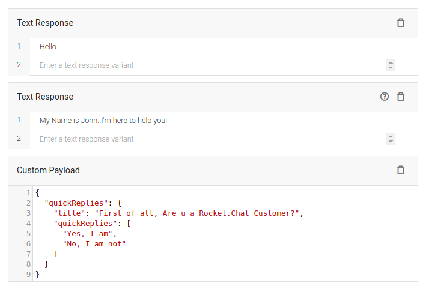
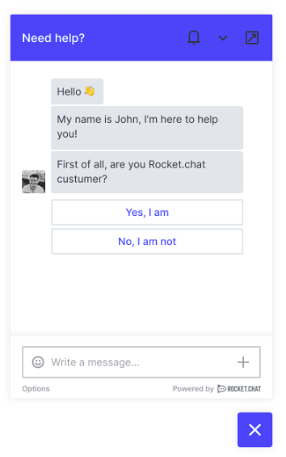

### Quick Replies Structure
```
{
  "quickReplies": {
    "text": string,
    "options": [
      string
    ]
  }
}
```

### Field description

1. `text`

- **Type**: string
- **Description**:  The title of the collection of quick replies

2. `options[]`
- **Type**: Array of string
- **Description**:  The collection of quick replies.

### Example

In this example, there are 2 simple text messages and one `quickReply` message

#### Dialogflow Dashboard



#### Corresponding Livechat widget


